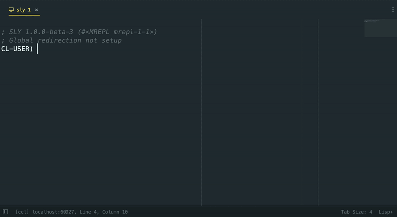
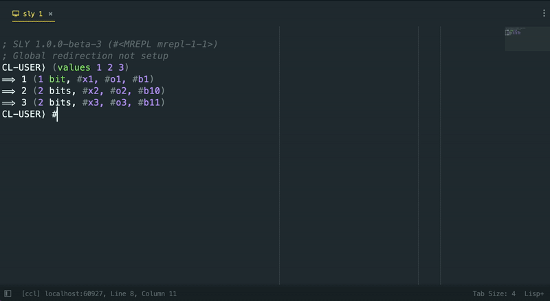

```
      ___           ___       ___           ___           ___                   ___           ___     
     /\  \         /\__\     |\__\         /\  \         /\__\      ___        /\__\         /\  \    
    /::\  \       /:/  /     |:|  |       /::\  \       /:/  /     /\  \      /::|  |       /::\  \   
   /:/\ \  \     /:/  /      |:|  |      /:/\:\  \     /:/  /      \:\  \    /:|:|  |      /:/\:\  \  
  _\:\~\ \  \   /:/  /       |:|__|__   /::\~\:\__\   /:/  /       /::\__\  /:/|:|__|__   /::\~\:\  \ 
 /\ \:\ \ \__\ /:/__/        /::::\__\ /:/\:\ \:|__| /:/__/     __/:/\/__/ /:/ |::::\__\ /:/\:\ \:\__\
 \:\ \:\ \/__/ \:\  \       /:/~~/~    \:\~\:\/:/  / \:\  \    /\/:/  /    \/__/~~/:/  / \:\~\:\ \/__/
  \:\ \:\__\    \:\  \     /:/  /       \:\ \::/  /   \:\  \   \::/__/           /:/  /   \:\ \:\__\  
   \:\/:/  /     \:\  \    \/__/         \:\/:/  /     \:\  \   \:\__\          /:/  /     \:\ \/__/  
    \::/  /       \:\__\                  \::/__/       \:\__\   \/__/         /:/  /       \:\__\    
     \/__/         \/__/                   ~~            \/__/                 \/__/         \/__/    

```

[](https://ko-fi.com/U7U11ZLB8)

Slyblime is Sylvester the Cat's Common Lisp IDE for **Sublime Text 4**:

Slyblime is an implementation of [SLY](https://github.com/joaotavora/sly) and uses the same backend (SLYNK). 

Currently it includes:

* REPL integration including backtracking
* Autocomplete and documentation
* References, disassembly, macroexpansion etc.
* Inspection support
* Tracing support
* Compilation support with notes
* Multiple connexions
* Debugger including stack frame inspection
* **NEW!** Ability to open an inferior Lisp directly from the editor!

The primary missing feature is the ability to use stickers from Sly.

## Installation
First install [SublimeREPL](https://github.com/wuub/SublimeREPL).
Use Package Control to install it, or download and unzip this plugin in your packages folder.
Then install SublimeREPL (via Package Control) and then type `Sly: Upgrade SublimeREPL to work with Sly` into the command palette and follow the instructions.
Finally, to get started just run `Sly: Start and connect to an inferior Lisp instance` in the command palette (you may need to change the default lisp program in the settings).

## Obligatory animated GIFs section
Flex Completion



Backreferences



## Usage
Make sure to install SublimeREPL (via Package Control) and then running `Sly: Upgrade SublimeREPL to work with Sly` into the command palette before attempting to use Slyblime!

### Using an inferior Lisp

Go to the settings and set the inferior lisp command to what you want (by default it's `lisp`).
After that run `Sly: Start and connect to an inferior Lisp instance` to start a inferior lisp and REPL.

### External connexion
To connect to a Slynk instance run `Sly: Connect to slynk` using the command palette.
Make sure to use the included `Lisp+` syntax for all the features to work correctly.

## Developping

The recommended way to develop is to clone this repo somewhere, then symlink the `src` folder to the Sublime packages folder and symlink the `sly` submodule folder into the `src` folder. While this may seem convolouted, this allows almost all files to remain toplevel in the package folder which means that Sublime Text will reload them upon modification, speeding up editing speed.

## Copying

See [COPYING.md](COPYING.md), but tl;dr GPL.

## Contributing

Open an issue or a pull request.

